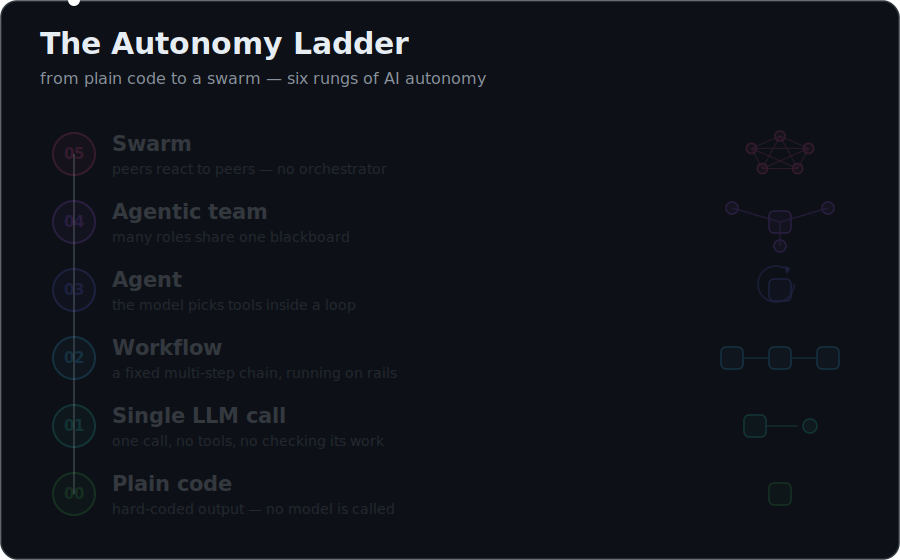

<div align="center">

# AI Systems Evolution : From Code to Swarm

**The same task, solved six times, each time with more autonomy.**
Run each rung in under a minute (zero setup) and *feel* the jump from a plain
script to an emergent swarm.

`code` → `single call` → `workflow` → `agent` → `agentic team` → `swarm`

> For project walkthroughs, architecture flowcharts, and system context, visit the live landing page: [my-portfolio-github-io-beta-five.vercel.app/projects/ai-systems-evolution.html](https://my-portfolio-github-io-beta-five.vercel.app/projects/ai-systems-evolution.html)

[](https://nodejs.org)
[]()
[]()
[](LICENSE)
[](LICENSE)

<br>



</div>

---

## Why this exists

Everyone uses the words (*workflow, agent, multi-agent, swarm*) and almost nobody agrees on where one ends and the next begins.

The confusion is not semantic. It's structural. A workflow and an agent look identical from the outside: give both a task, get output back. The difference is *where the decisions live*. In a workflow, a human wrote every branch. In an agent, the model picks at runtime.

Arguing about definitions doesn't fix this. Running them back-to-back does.

This repo solves **one task** ("write a 3-bullet executive brief on a topic") **six times**, each time adding one increment of autonomy. The lesson is the **diff between the rungs** : which you feel by running them in sequence.

---

## The autonomy ladder

```mermaid
graph LR
    R00["00 plain code\nno model"] --> R01["01 single call\none prompt, stateless"]
    R01 --> R02["02 workflow\nfixed chain, human wrote the path"]
    R02 --> R03["03 agent\nLLM + tools + loop\nmodel picks the path"]
    R03 -.-> R035["03.5 agent + memory\nstate survives the run\n(bridge)"]
    R035 -.-> R04
    R03 --> R04["04 agentic team\nroles + orchestrator\n+ shared blackboard"]
    R04 --> R05["05 swarm\npeers, no boss\ncoordination emerges"]

    style R00 fill:#1e293b,stroke:#475569,color:#94a3b8
    style R01 fill:#1e293b,stroke:#475569,color:#94a3b8
    style R02 fill:#1e293b,stroke:#6366f1,color:#f8fafc
    style R03 fill:#1e293b,stroke:#6366f1,color:#f8fafc,strokeWidth:3px
    style R035 fill:#0f172a,stroke:#6366f1,color:#cbd5e1,stroke-dasharray:4 3
    style R04 fill:#1e293b,stroke:#a855f7,color:#f8fafc
    style R05 fill:#1e293b,stroke:#10b981,color:#10b981
```



> **Optional half-rung (03.5): agent with memory.** The six rungs are the spine.
> One bridge step sits between *agent* and *team*: a single agent that *remembers*
> across runs. A team needs shared memory; first a lone agent has to have any. It is
> marked as a dashed step because the ladder still reads as six. See
> [`03.5-agent-with-memory`](03.5-agent-with-memory/).

The two lines people always blur:

- **Workflow → Agent (02 → 03):** A workflow runs on a path a *human* wrote. An agent lets the *model* choose. Two ingredients flip it: **tools** (something to act with) and a **loop** (more than one step).
- **Team → Swarm (04 → 05):** A team has an orchestrator in charge. A swarm has no central control : coordination emerges from peers reacting to peers.

---

## Run it (zero setup)

Node 18+, no dependencies, no API keys. Runs fully offline in **mock mode** by default.

| Rung | Folder | Command | What you see |
|------|--------|---------|--------------|
| 00 | [`00-plain-code`](00-plain-code/) | `node 00-plain-code/main.js` | Hard-coded logic, no model call |
| 01 | [`01-single-llm-call`](01-single-llm-call/) | `node 01-single-llm-call/main.js` | One prompt, one answer, done |
| 02 | [`02-workflow`](02-workflow/) | `node 02-workflow/main.js` | Outline → draft → polish, on rails |
| 03 | [`03-agent`](03-agent/) | `node 03-agent/main.js` | Model searches, then answers |
| 03.5 | [`03.5-agent-with-memory`](03.5-agent-with-memory/) | `node 03.5-agent-with-memory/main.js` | Run twice: searches once, then remembers (bridge) |
| 04 | [`04-agentic-team`](04-agentic-team/) | `node 04-agentic-team/main.js` | Planner assigns workers, reviewer approves |
| 05 | [`05-swarm`](05-swarm/) | `node 05-swarm/main.js` | Peers improve each other's draft |

Use a real model with one env var : see [`SETUP.md`](SETUP.md):

```bash
LLM_MOCK=0 OLLAMA_MODEL=llama3 node 03-agent/main.js
```

---

## Interactive explainer

Open [`web/index.html`](web/index.html) in a browser (or host it on GitHub Pages). Click any rung to see what it adds, the code, and a simulated run trace. Opens on rung 03 by default : the most important rung, where autonomy begins.

---

## Side-by-side comparison

See [`COMPARISON.md`](COMPARISON.md) for a full table: inputs, outputs, who wrote the logic, number of LLM calls, and failure modes at each rung.

---

## How this fits the stack

```
AI-systems-evolution   ← you are here (the "what" and "why", for everyone)
        |
        ├─► Agent-Anatomy        zoom into rung 03: what an agent is made of
        ├─► agentic-patterns     the architecture theory behind the choices
        ├─► agentic-systems      five runnable production-grade agent systems
        └─► agentkernel          the infra engines underneath
```

New here? This is the front door. Start at rung 00, run each one, finish at 05. Then follow any branch above.

---

<div align="center">

Built by [Shubham Prajapati](https://github.com/shubham0086) ·
[Portfolio](https://my-portfolio-github-io-beta-five.vercel.app/)
· Code: MIT · Explanatory content: CC BY 4.0

</div>
